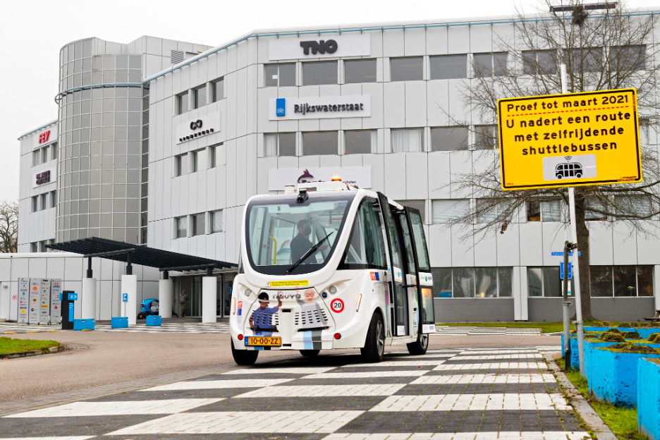
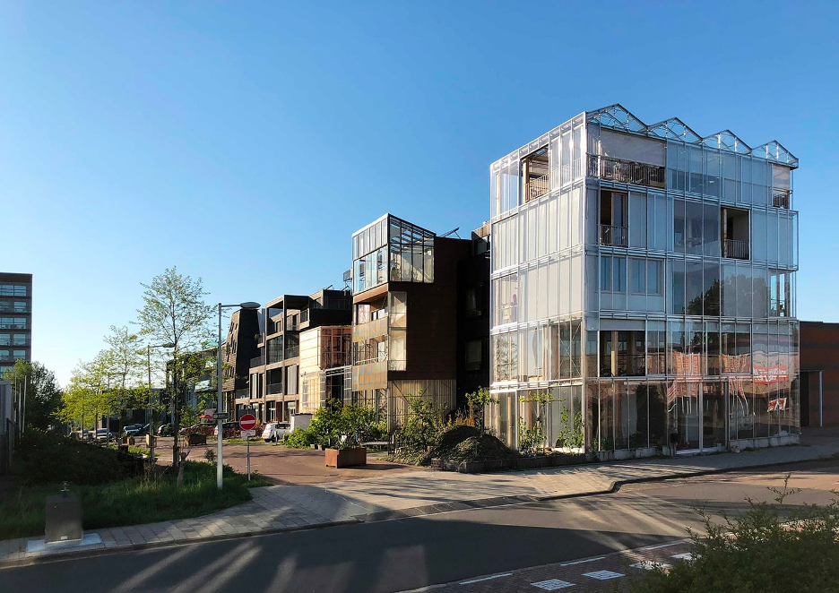
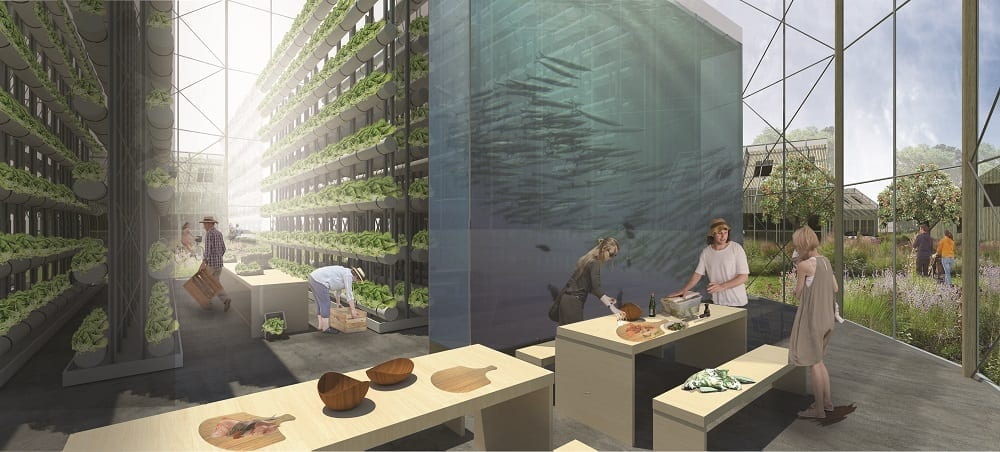

## Overview

<!-- About 100 to 150 word summary of the case study. -->

The Brainport Smart District (BSD) is a collaboration between the Brainport Initiative, the city of Helmond, a suburb of Eindhoven Netherlands, and the Eindhoven University of Technology. The project aims to create the world’s smartest district and a test ground for tomorrow's society. These goals are reflected both in the technology used in the neighborhood and the participatory process by which these technological interventions were selected. An emphasis has been placed on the collaborative structures of the project whereby stakeholders are actively engaged in envisioning the district of tomorrow. The BSD plans were first unveiled in 2019 and first permeant construction on the cite is set to begin late 2023. There are plans to construct 1500 homes by 2029 and for slow but steady growth throughout the life of the district. 

## Key Characteristics

<!--  Summarize the most visible essential characteristics of the project. For districts: How does the district employ 3-5 of the key characteristics of New Century Cities? For plans: How does the plan address each of the three activities (development, engagement, implementation) of the digital masterplanning process described in the 2015 Townsend and Lorimer paper?
-->

**Promote Sustainability**.  The smart district actively considers sustainability in the foundation of its design. A “smarter energy grid” with distributed renewable energy generation and storage is part of this vision, as is local food production and an adaptive water network. The district is directly designed to create a resilient and self-sufficient community in the face of climate change.

**Mixed Use Neighborhood**.  The district aims to be an attractive neighborhood where an active lifestyle is promoted. A combination of retail and commercial spaces not commonly seen in the town of Helmond is planned. There is a vision of healthcare system with a focus on preventative care, and designing neighborhoods that promote healthy living is a key part of this vision.

**Foster Linkages Between Universities and Businesses**.  The partnership between Eindhoven University of Technology and Brainport Eindhoven runs deep, as the university is located directly within a region home to over 5000 tech companies. The opportunity to collaborate on the implementation innovative technology in a new district is attractive to both the university and local tech companies.

## Goals and Aspirations

<!-- Summarize the most important goals of the project. Replace the placeholder title with a succinct name for the goal. The text should be around 50 words. -->

**Testing Ground for Innovation**. In their aims to create the smartest district in the world, the Brainport Smart District will integrate innovative technologies into the district. This will be done first at a living lab where 100 homes are set aside to vet the newest advances before they are applied at a district level. 

**Self Sustaining**. In aiming to become a model community, achieving self-sustainability was identified as a mark of success for the project. If more food and energy can be produced locally each year, then the district will be on its way to achieving this ambitious goal.  

**Collaborative **. The community aims to actively include all stakeholders in the community building process, and this goal will help carefully and thoughtfully integrate contentious technology into the district. 

## Technology Interventions
<!--  Identify 3-5 specific technology-enabled interventions the project employs or proposes. The text should be around 75-125 words. Separate into more than 1 paragraph as needed. This is a good place to insert additional images, be sure to include captions identifying the source and make sure to not use copyrighted images. -->

**Mobility Innovations**.  Goals to innovate mobility in the district take variety of forms in the smart district. These include a shared EV network, subsides for battery powered electric vehicles, an ebike rental network, mobility as a service (MaaS), extending the electric bus rapid transit (BRT) network, and fully autonomous connected vehicles (ACVs). Active consideration is paid to the tradeoffs between incentivizing personal vehicle use to allow for better first-last mile solutions and inadvertently competing with an ultimately more sustainable option in public transit. The BSD is also cognizant that while ACVs are in active development in Brainport Eindhoven and represent the most transformative of the proposed technologies, they also present the most risk and should thus not be the current focus of the mobility goals. 

**Local Food Production**. BSD aims to create extensive food production facilities within the district is perhaps the most ambitious goal of the BSD. Growing enough food for the planned 1500 homes by the end of the decade is a tall order, but plans are in place to realize this. Apps to manage food inventory, vertical greenhouses using aquaponics, urban farms integrated into mixed use neighborhoods and community gardens in the forest are some proposals to grow sustainably for the district. While project proposals are underway, such as those conducted by DGVGroup and cc-studio, the outcomes of feasibility studies are not yet available to the public, and therefore it is unclear how attainable these projects are.  

**Rethinking Data**. Residents relationship with data is being reconsidered by approaching it as a valuable asset that can be utilized to enhance the quality of life for its residents while respecting privacy and ensuring data security. Some concepts to facilitate this include giving individuals ownership and control over their data. Residents will have the authority to decide how their personal data is collected, stored, and used. BSD also leverages data to inform decision-making processes. Smart infrastructure and sensors are proposed to be used to gather real-time data about various aspects of the district, such as energy consumption, waste management, water usage, transportation patterns and air quality. By collecting and analyzing these data the BSD can actively make evidence-based decisions to optimize the functioning of the district. 

## Stakeholder
<!--  Identify 3-5 key stakeholder organizations or groups. The text should be around 50 words, and include a link to the organization.-->

**Residents**. The Brainport Smart District actively involves Helmond resident communities in the development process, encouraging their input and participation to shape the district's design and services, fostering a sense of ownership and community engagement. 

**Government**. The project collaborates closely with local and national government bodies, ensuring alignment with urban development policies and regulations. Government support and participation are crucial for the successful implementation of the district's sustainable and smart initiatives. [Eindhoven Gov](https://www.eindhoven.nl/en/)

**Academics**. Academics play a significant role in the Brainport Smart District, contributing expertise to drive innovation and realize sustainable solutions. Collaborations with Eindhoven Technical University enhance the district's tech development and provide insights for future urban planning while offering a place for students to apply their knowledge post-graduation.
[TU/e](https://brainporteindhoven.com/int/discover/campuses/tue)

**Business Partners**. The BSD engages with a range of business partners including technology companies like ASML, Philips, NXP and Signify. These partnerships support and shape the district's vision for what innovation looks like. For example, IOT innovations within the BSD are made possible by Philips designing the devices, NXP designing the integrated circuits, and ASML manufacturing the semiconductors. [Brainport Company List]( https://brainporteindhoven.com/int/for-you/work/companies)

**Brainport Eindhoven**.  Brainport Eindhoven provides expertise, support, and collaboration opportunities to the BSD, ensuring alignment with the broader regional goals of fostering innovation and economic development in Eindhvoen and its suburbs. Additionally, the BSD is a testing ground for much of the technology developed within the Brainport. [Brainport Eindhoven]( https://brainporteindhoven.com/int/)

## Leadership
<!--  Conduct one interview with a project leader, and link to a LinkedIn or other profile. Provide a brief biography, no more than 75 words. Identify 3-5 insights or themes from the interview. Feel free to add a photo of the individual here. -->

**Ren Yee**. While I reached out to several interview subjects including BSD business development director Peter Portheine and RNstudio designer Ren Yee, I was unable to secure an interview. That said, the contact information for the BSD team is available online as a source for potential future interviews. [Potential_Interview_Subjects]( https://brainportsmartdistrict.nl/en/organisation/#board) 
In the following section I will summarize key themes from a presentation Ren Yee gave to the Cornell Tech Urban Tech Hub in November of 2020. [Ren_yee_presentation](https://www.youtube.com/watch?v=XKiyG_bRyOU&list=PLBJ0J99hMlCQSwhMeWGMwSY1GTnqKwzA2&index=2)

**Collaborative Process**. From the beginning, stakeholders including businesses, academics, government, and most importantly the citizens, were engaged. These included future residents as well as those who have never been to the district and will likely never move there. Resident input is the basis of the participatory design process and having such extensive collaboration from day 1 is a novel approach for UNstudio. 

**Constant Change**. “The district is never ‘finished’, but will constantly be adapted to changing circumstances, wishes and technologies.” The design was not aimed at one vision of the future but instead focused on flexible mechanisms to encourage evolving project goals. 

**Alternative Economic Models**. Giving individuals an active position in the digital ecosystem will lead to alternative economic models. Reallocate resident disposable income away from rent and towards active developments in their community. Reimagine data use to support and empower residents through collective buying and the abolition of data brokers.

**Facilitate Comfort with Technology**. Working to prevent residents from feeling intimated by new technology. The BSD positions itself against digital monopolies by giving residents control over their own data, restoring trust, and emphasizing privacy. 

## Financing
<!--  Identify at least one financing scheme being used in this project or plan. About 100 words is probably a good length for this. -->

**Financing Scheme**. One main source of funding comes from the Dutch National Growth Fund, which allocated 20 billion euros between 2021 and 2025 for investing in technological innovations stimulating growth in the Netherlands. The fund aims to invest in projects and initiatives that contribute to long-term economic growth, job creation, and societal benefits. It primarily focuses on large-scale, innovative projects with significant economic potential. Early this year, the fund set aside 7.5 million euros to facilitate the first wave of permanent housing. These homes will begin construction in early 2024 and will add to the 52 temporary homes already built.  [Funding_Announcement] (https://brainportsmartdistrict.nl/rijk-investeert-miljoenen-in-de-wijk-van-de-toekomst/)

## Outcomes
<!-- Identify 3-5 (anticipated) outcomes. What will/has the project achieved? Thes should not be the same or repeated from elsewhere. Use this space to emphasize something different. About 50 words per is minimum, but these can be as long as you want/need. -->

**Model For the Future**.  The BSD has the potential to stimulate economic growth and create employment opportunities in Helmond, outside the main of hub of Eindhoven. Anticipated outcomes include the attraction of businesses, startups, and research partnerships, which can generate job opportunities and contribute to the district’s economy. 

**Experimental Living Environments**.  The BSD provides an opportunity to explore experimental living concepts and alternative housing models. Anticipated outcomes include the development of innovative housing designs, such as modular and adaptable structures, co-living arrangements, and sustainable building materials. These experiments will contribute to the evolution of housing practices.

**Improved Health**. The Brainport Smart District will incorporate smart technology to improve the health of its residents. Personal sensing sensors will be used to monitor air quality, noise levels, and other environmental factors that affect resident well-being. Additionally, BSD is investigating creating better environmental air quality through practices like alternative heating.

**Equitable Housing Allocation**.  The district announced in April 2023 that 25% of all residences constructed will be set aside for social housing. This demonstrates a commitment to the ideals of the district by creating a neighborhood where people of all backgrounds are welcome.

## Open Questions
<!--Identify 1-3 open question(s). What is uncertain, unclear, or still unresolved about this project? These can be 50 words or less. -->

** What will project execution look like?**. While residents currently have outsized influence over other stakeholders, as more money gets invested and corporations gain interest in the project this may change. It will be interesting to see how priorities shift and if the ideals of the BSD are compromised as the development grows.

**Is this much participation is feasible?**. While their democratic approach gives voice to those often left out of city planning conversations, the tradeoff is this project is taking longer to get off the ground. Will this level of participation be continued once the project is a fully formed community? How will the ways residents are encouraged to participation change?

## References

---

### Primary Sources

<!-- 3-5 project plans, audits, reports, etc. -->
- https://brainportsmartdistrict.nl/en/organisation/programs/
- https://www.unstudio.com/en/page/11722/brainport-smart-district
- https://research.tue.nl/files/147834036/Kerssens_.pdf

### Secondary Sources

<!-- 5-7 secondary source documents: news reports, blog posts, etc.. -->
- https://www.nytimes.com/2020/07/24/realestate/brainport-smart-district-takes-shape-in-the-netherlands.html
- https://www.dezeen.com/2019/03/05/smart-neighbourhood-brainport-smart-district-unstudio-netherlands/#
- https://urbannext.net/brainport-smart-district/
- https://closercities.org/projects/transdisciplinary-decisionmaking-brainport-smart-district#no-back
- https://www.polisnetwork.eu/wp-content/uploads/2021/12/4C.-Matthieu-Graindorge.pdf
- https://www.architectour.net/opere/opera.php?id_opera=6962

